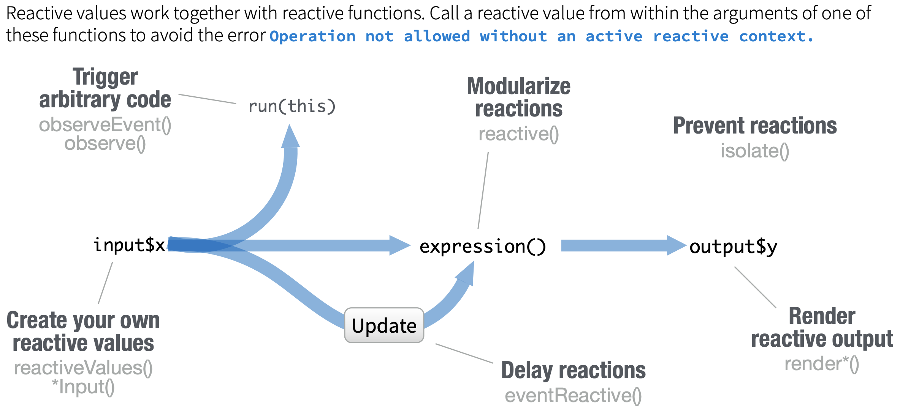

## Reactivity

We've already seen some examples with our `render` functions, but what exactly is **reactivity**?

Reactivity is a 2-step process

1. **Reactive values** *notify* functions that use them when they become invalid

2. Objects created by **reactive functions** *respond*

## Some Reactive Functions

* render*() functions
* reactive()
* reactiveValues()
* eventReactive()
* observe()
* observeEvent()

## More Harry Potter Comparisons

The Knight Bus is our connection between regular R code (Muggle World) and the world of reactives (Wizarding World)

`knight_bus <- function(input, output, session) {`
    reactive code here!
`}`

## 3 Types of KB Passengers

| inputs | conductors | observers |
|  ---   |    ---     |    ---    |
|  |  |  |
| `actionButton()` | `reactive()` | `observe()` |
| `selectInput()`  | `eventReactive()` | `observeEvent()` |
| `reactiveValues()`            | `renderText()` | `textOutput()` |

## Reactives

***Reactives have 2 kinds of states***

1. **Their value**, e.g. numerical/text value, plot, image
2. **Their validity**--validated, invalidated

***Reactives have connections***

* Inputs have outward connections
* Observers have inward connections
* Conductors have both inward and outward connections

## Reactivity Diagram

## Project 2: Pythagorean Theorem

- Run `pythagorean-1.R` and change the input values a few times.

- Stop the app

- Run `reactlogShow()` (may need to install first)

## Adding an expression: modularizing reactions

- Run `pythagorean-2.R` and change the input values.

- Stop the app

- Run `reactlogShow()`

- Reactives are lazy and only update when they need to

## Reactives vs. observers

**Reactives**: calculate or cache a value, meant to be used as a variable, has a result

**Observers**: runs some code when a dependency changes, doesn't yield a result, isn't used as input for other expressions, not assigned to a variable

